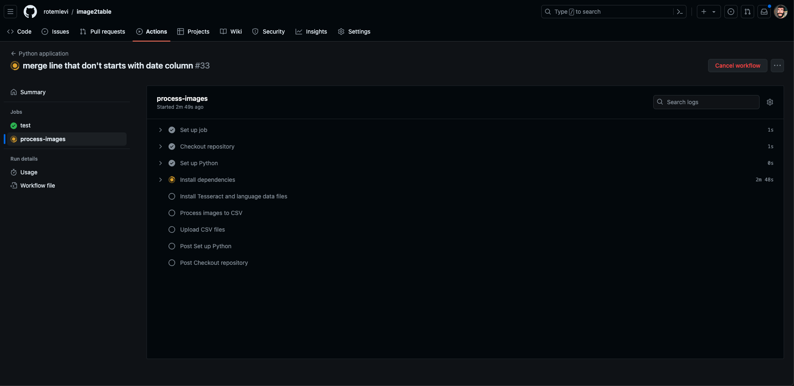
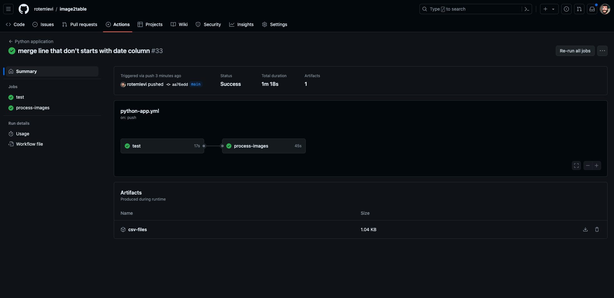

# OCR Image Processing

This project processes images to extract text using OCR and converts the text into structured data in a CSV format.

## Setup

### Prerequisites

- Python 3.12.3+
- Tesseract OCR
- GitHub Account
- Git

### Creating a GitHub Account

1. Visit the [GitHub Signup Page](https://github.com/join)
2. Fill in the required details (username, email, password) and complete the sign-up process.
3. Verify your email address by clicking on the verification link sent to your email.

### Installing Git

#### Windows

1. Download Git for Windows from the official website: [git-scm.com](https://git-scm.com/download/win)
2. Run the installer and follow the instructions.
3. Verify the installation:
    ```sh
    git --version
    ```

#### macOS

1. Install Homebrew if you haven't already:
    ```sh
    /bin/bash -c "$(curl -fsSL https://raw.githubusercontent.com/Homebrew/install/HEAD/install.sh)"
    ```
2. Install Git:
    ```sh
    brew install git
    ```
3. Verify the installation:
    ```sh
    git --version
    ```

#### Linux (Ubuntu)

1. Update the package list:
    ```sh
    sudo apt update
    ```
2. Install Git:
    ```sh
    sudo apt install git
    ```
3. Verify the installation:
    ```sh
    git --version
    ```

### Installation

1. Clone the repository:
    ```sh
    git clone https://github.com/your-username/ocr-image-processing.git
    cd ocr-image-processing
    ```

2. Install the required Python packages:
    ```sh
    pip install -r requirements.txt
    ```

3. Ensure Tesseract is installed and the `TESSDATA_PREFIX` environment variable is set:
    ```sh
    export TESSDATA_PREFIX=/usr/local/share/tessdata/
    ```

### Installing Python and Pip

#### Windows

1. Download Python from the official website: [python.org](https://www.python.org/downloads/windows/)
2. Run the installer and follow the instructions, ensuring to check the box to add Python to your PATH.
3. Verify the installation:
    ```sh
    python --version
    pip --version
    ```

#### macOS

1. Install Homebrew if you haven't already:
    ```sh
    /bin/bash -c "$(curl -fsSL https://raw.githubusercontent.com/Homebrew/install/HEAD/install.sh)"
    ```
2. Install Python:
    ```sh
    brew install python
    ```
3. Verify the installation:
    ```sh
    python3 --version
    pip3 --version
    ```

#### Linux (Ubuntu)

1. Update the package list:
    ```sh
    sudo apt update
    ```
2. Install Python:
    ```sh
    sudo apt install python3 python3-pip
    ```
3. Verify the installation:
    ```sh
    python3 --version
    pip3 --version
    ```

## Usage

1. Place the images to be processed in the `data/images` directory.

2. Run the main script with the images directory and output directory as arguments:
    ```sh
    python src/main.py data/images data/output
    ```

3. The processed CSV files will be saved in the specified output directory.

### Example CLI Usage

```sh
python src/main.py data/images data/output
```

### Using CI/CD with GitHub Actions

This project uses GitHub Actions for CI/CD. When you push images to the `master` branch, the GitHub Actions workflow will automatically process the images and upload the CSV outputs as artifacts.

1. **Push Images to GitHub**:
    ```sh
    git add data/images/
    git commit -m "Add new images"
    git push origin master
    ```

2. **Download CSV Outputs**:

   - Go to the Actions tab in your GitHub repository.
   - Select the latest workflow run.
   - Scroll down to the `Artifacts` section.
   - Download the `csv-files` artifact.

### Example Screenshots

#### GitHub Actions Workflow Run



#### Downloading Artifacts



## Contributing

Contributions are welcome! Please open an issue or submit a pull request.

## License

This project is licensed under the MIT License. See the [LICENSE](LICENSE) file for details.
